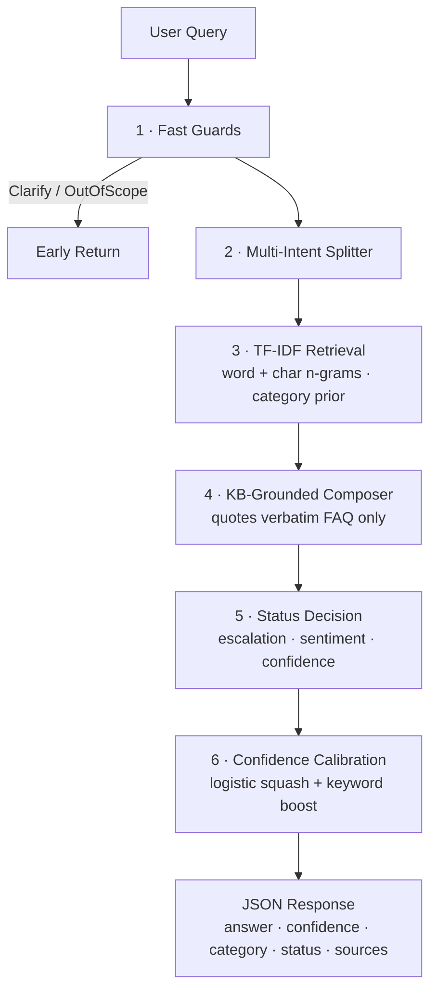

<div align="center">

# 🤖 BenchBuddy AI

### A Gen-AI **PMO knowledge assistant** that turns bench-associate questions into instant, **grounded, escalatable** answers — with **zero hallucination**.

**🏆 Winner — EngX Generative AI Kata, 19 Jun 2026**

<br/>

[](https://benchbuddy.streamlit.app/)
[](https://github.com/adityayadav97/benchbuddy-ai)


</div>

---

## 📑 Table of Contents

- [🎯 What It Does](#-what-it-does)
- [🏗️ Architecture](#️-architecture)
- [🚀 Quickstart](#-quickstart)
- [📂 Project Structure](#-project-structure)
- [🧠 How It Works (Anti-Hallucination)](#-how-it-works-anti-hallucination-by-design)
- [⚖️ Jury / QA Verification](#️-jury--qa-verification)
- [🧰 Tech Stack](#-tech-stack)
- [🔌 Extending](#-extending-optional--bonus)

---

## 🎯 What It Does

BenchBuddy AI is a lightweight **RAG-style assistant** that answers PMO questions for bench associates using **only** the approved PMO FAQ knowledge base. Every reply ships with the four fields the kata requires:

| Field | Example |
| :--- | :--- |
| `answer` | "Update it in the Employee Profile Portal under Skills." |
| `confidence` | `0.95` (also `confidence_pct: 95`) |
| `category` | `Skills` |
| `status` | `Answered` · `Escalate` · `Clarify` · `OutOfScope` |

A live **modern dark-mode UI** sits on top of the same JSON API — with quick-start chips, animated confidence bars, color-coded category badges, source citations, an analytics dashboard, an escalation-ticket flow, and a browsable knowledge-base view.

> 🌐 **Live demo** → **<https://benchbuddy.streamlit.app/>** · 📐 **Architecture** → [`architecture/diagram.md`](./architecture/diagram.md)

---

## 🏗️ Architecture



The response contract: `{ answer, confidence, confidence_pct, category, status, escalation_target, sources[], intents_detected[], sentiment, latency_ms, query_id, timestamp }`. See [`architecture/diagram.md`](./architecture/diagram.md) for the full flowchart, sequence diagram, and UML class diagram.

---

## 🚀 Quickstart

**Option A — full FastAPI app (rich vanilla-JS UI)**

```bash
python3.13 -m venv .venv && source .venv/bin/activate
pip install -r requirements.txt
uvicorn backend.main:app --host 127.0.0.1 --port 8765
# open http://127.0.0.1:8765/
```

**Option B — Streamlit version (one command, deployed to Streamlit Cloud)**

```bash
streamlit run streamlit_app.py    # opens http://localhost:8501
```

**Run the test suite** (expected: **11 passed**)

```bash
pip install pytest && python -m pytest tests/ -v
```

**Hit the API directly**

```bash
curl -s http://127.0.0.1:8765/api/query \
  -H "Content-Type: application/json" \
  -d '{"query": "Can I claim AWS certification reimbursement?"}' | python3 -m json.tool
```

---

## 📂 Project Structure

```
benchbuddy/
├── backend/                # FastAPI + retrieval engine
│   ├── main.py             #   REST endpoints
│   ├── engine.py           #   TF-IDF retrieval + reasoning + escalation
│   ├── kb_loader.py        #   merges PMO_FAQ_Knowledge_Base*.xlsx
│   └── models.py           #   Pydantic request/response schemas
├── frontend/               # Vanilla HTML / CSS / JS SPA
│   ├── index.html          #   5 tabs · chat · KB · analytics · tickets · about
│   ├── styles.css          #   dark + light themes, animated confidence bar
│   └── app.js              #   chat, modal, voice, shortcuts, toasts, export
├── data/                   # PMO FAQ knowledge base (xlsx) + jury queries
├── tests/                  # 11 pytest cases — all green in 0.7s
├── architecture/           # mermaid system + sequence + class diagrams
├── streamlit_app.py        # Streamlit Cloud entry point
├── requirements.txt
├── run.sh                  # one-command bootstrap
└── README.md
```

---

## 🧠 How It Works (Anti-Hallucination by Design)

The pipeline is **retrieval-grounded** — it never invents facts:

1. **Fast guards** — catch empty / out-of-scope queries early.
2. **Multi-intent splitter** — handles compound questions ("rolled off ... and ... interview tomorrow").
3. **TF-IDF retrieval** — word n-grams (1,2) + char n-grams (3,5) + category lexical prior.
4. **KB-grounded composer** — **only** quotes verbatim FAQ answers.
5. **Status decision** — escalation triggers, sentiment, and confidence thresholds.
6. **Confidence calibration** — logistic squash + keyword boost.

### Why no LLM by default?

The kata explicitly requires: **avoid hallucination, no external knowledge, must run fast**. A pure retrieval engine satisfies all three and gives **reproducible, auditable** answers. A clean integration point in `engine.py::_compose_answer` lets EPAM DIAL or a HuggingFace model plug in later — without rewiring the API.

---

## ⚖️ Jury / QA Verification

| Query | Expected Category | Expected Action | BenchBuddy AI |
| :--- | :--- | :--- | :--- |
| Update my skill | Skills | Answer | ✅ Skills · Answered (95%) |
| Reimbursement | Certification | Answer | ✅ Certification · Answered (79%) |
| Nobody contacted me | Staffing | Escalate | ✅ Staffing · Escalate (64%) |
| Very frustrated | Sentiment | Escalate | ✅ Sentiment · Escalate |
| Help me | Unknown | Clarify | ✅ Unknown · Clarify |

**Jury challenge queries**

1. *"I was rolled off from Project Falcon yesterday. My RM is on leave and I have an interview tomorrow."* → **Escalate** · multi-intent (`Bench Policy + Interview + Onboarding`) · routed to **PMO Staffing Team / RM** · 80% conf · 3 ms.
2. *"I updated my resume but staffing still cannot see it."* → **Escalate** · `Resume` · "still cannot" trigger → routed to PMO · 67% conf.
3. *"Can I claim reimbursement for a certification completed before joining EPAM?"* → **Answered** · `Certification` · 79% conf.

All covered by automated pytest cases in [`tests/test_engine.py`](./tests/test_engine.py). **Guard-rails:** out-of-scope queries return `OutOfScope` politely; gibberish (`xyzzy`, `asdfghjkl`, `" "`) always returns a non-empty answer + valid status.

---

## 🧰 Tech Stack

| Layer | Choice |
| :--- | :--- |
| **Backend** | Python 3.13 + FastAPI (rich UI) · Streamlit (cloud) |
| **Retrieval** | scikit-learn TF-IDF (word + char n-grams) + cosine similarity |
| **KB Load** | openpyxl |
| **Frontend** | Vanilla HTML / CSS / JS — no build step |
| **Tests** | pytest (11/11 passing) |

> ⚡ No internet, no model download — runs offline on a fresh laptop in ~5 s.

---

## 🔌 Extending (Optional / Bonus)

- **EPAM DIAL / HuggingFace LLM** — drop a call into `engine.py::_compose_answer` with retrieved KB rows as context; the Pydantic contract stays the same.
- **Persistent analytics** — swap the in-memory deque in `main.py` for SQLite to track FAQ-coverage gaps over time.
- **MS Teams bot** — the JSON API is already in Teams adaptive-card-friendly shape.

---

<div align="center">

### Built by **Aditya Yadav** — Data Engineer @ EPAM Systems

[](https://adityayadav97.github.io/)
[](https://linkedin.com/in/theadityayadav)
[](https://github.com/adityayadav97)

<sub>🏆 EngX Generative AI Kata Winner · 19 Jun 2026 · 📜 MIT License © Aditya Yadav</sub>

</div>
