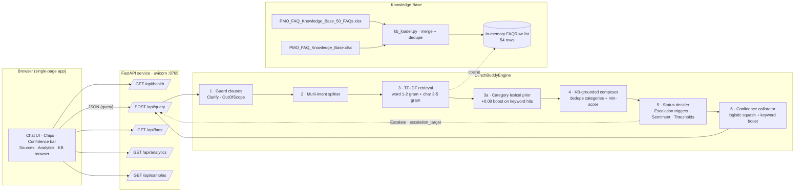
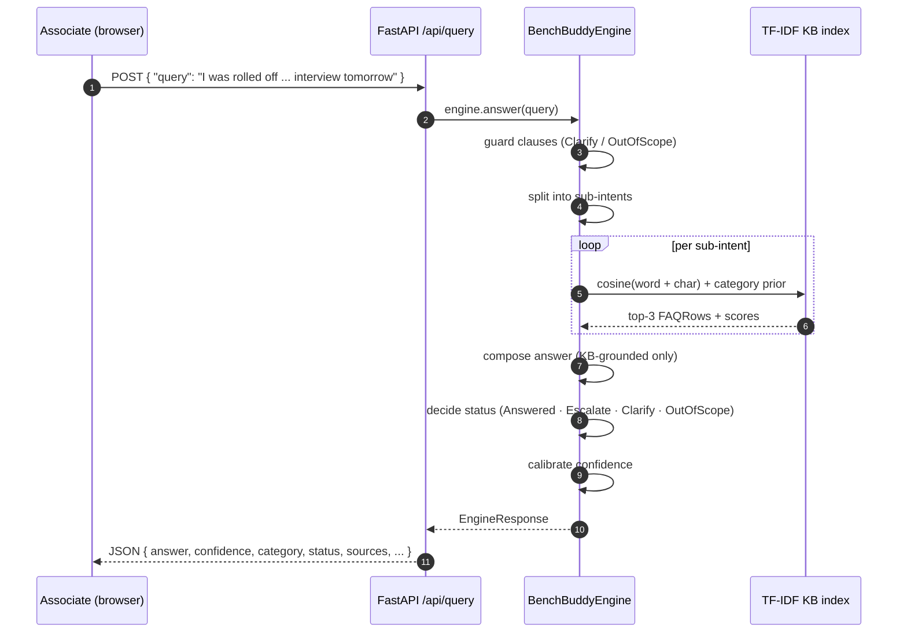
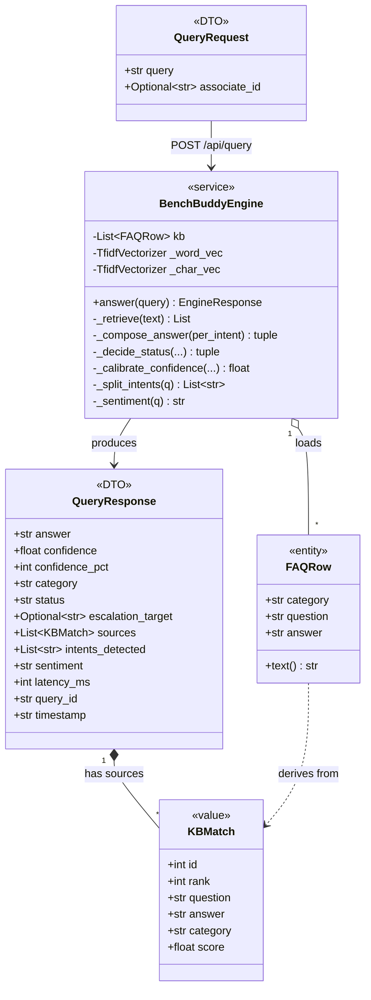

# BenchBuddy AI — Architecture

## System diagram

## Request lifecycle

## UML Class diagram (data model + engine)

## Status decision matrix

| Signal                                    | Status         | Notes                                      |
| ----------------------------------------- | -------------- | ------------------------------------------ |
| Greeting / single word / `?`              | `Clarify`      | guard clause                               |
| Weather / cricket / salary / promotion    | `OutOfScope`   | guard clause                               |
| Escalation phrase (urgent · still cannot · nobody · frustrated · rolled off · RM on leave · interview tomorrow) | `Escalate`     | routed to `PMO Staffing` / `Hiring Coordinator` / `PMO Cert Desk` / `Onboarding Coord` / `PMO Team` |
| Negative sentiment + low retrieval        | `Escalate`     | category becomes `Sentiment`               |
| Cosine similarity ≥ 0.15                  | `Answered`     | KB row quoted verbatim                     |
| Cosine 0.07 – 0.15                        | `Clarify`      | bot asks for more detail                   |
| Cosine < 0.07 and no domain keyword       | `OutOfScope`   | polite refusal                             |
